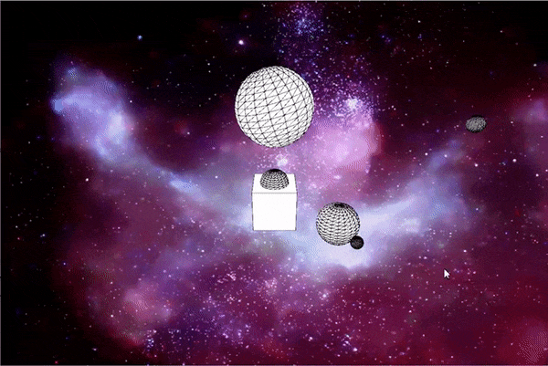

# transformation_orbits
Planetary system and ship control with third-person camera option in Processing

This program has 2 different scenes: the first one is a text "Star Wars"-like and the second one is a planetary system with a user-controlled ship. The user can control the directions with WASD, height with ZC, rotation with QE, can reset the position of the ship with R and can change the view to a third person view with V.

